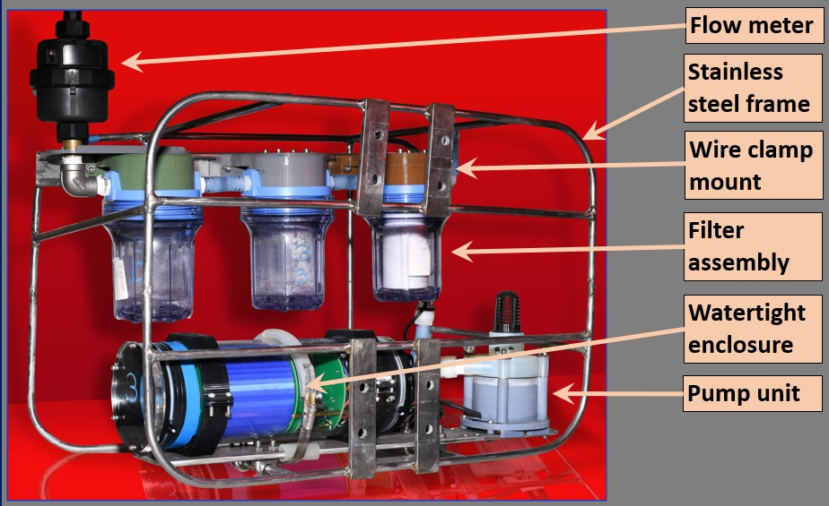

# in_situ_pump
_A low cost, open source in situ pump for marine and freshwater sampling being developed at Florida International University by Mark Stephens and Andres Martinez._

<b>Motivation: </b>In situ pumps allow for simultaneous sampling at multiple depths. However, commercially available units can cost tens of thousands of dollars. For applications involving shallow deployments, a more feasible solution is desirable. Our intention is to provide a complete step-by-step guide for building, programming, and operating the in_situ_pump. The system is adaptable for use in a variety of environments and projects. Community input and collaborations are most welcome. 

## Features
* 3D printed pump unit driven by a [Blue Robotics subsea motor](https://bluerobotics.com/store/thrusters/t100-t200-thrusters/m200-motor/).
* Controlled by a [Teensy 4.1](https://www.pjrc.com/store/teensy41.html) development board.
* Electronics and power supply inside watertight enclosure.
* Adaptable to various filter media (cartridges, GFF, acrylic fiber, etc.).
* Adaptable to sampling different chemical and isotopic species in the dissolved and particulate phases in seawater and freshwater.
* Simple operation.
* Easily programmable start delay, sampling duration, and motor speed.

## Fact Sheet:
* Materials cost: ~$2000 US.
* Power supply: c-cell batteries (can be adapted to other batteries including lithium).
* Maximum depth: 300 m.
* Sensors: pressure (depth), temperature, flow rate, voltage, DC current.
* Data storage: microSD card.
* Communications: USB.
* Dimensions: 24 x 18 x 12 in.
* Weight: 40 lb.
  

## How to Get One

## Hardware

	(drawing)
	(frame)
	(Pump)
	(electronics assembly)
	(filter holder assembly)

## Software
<table>
<TR>
<TD>
<a href="https://www.arduino.cc/en/software/">Arduino IDE</a>
the <a href="https://www.pjrc.com/teensy/teensyduino.html")Teensyduino</a> add-on for Arduino IDE
KurtE <a href="https://github.com/KurtE/MTP_Teensy")MTP_Teensy</a> library
the <a href="https://github.com/bluerobotics/BlueRobotics_MS5837_Library">Blue Robotics_MS5837_Library</a>
</TD>
<TD>

</td>
</tr>
</table>

## Deployments

### South Florida Test Cruise
The first ever deployments of the in_situ_pump were conducted  in the Gulf Stream offshore South Florida and the Florida Keys on a cruise aboard R/V Walton Smith, October 7-9, 2025. Additional cruises are planned for 2026 in the Sargasso Sea.

 |  

## Acknowledgements
*This project is supported by the U.S.National Science Foundation (Grant # NSF-OCE-2446521). We are grateful for technical support and advice provided at Florida International University's Applied Research Center (FIU-ARC) from the following individuals: Dr Yipeng He, Theophile Pierre, Gabriel Cerioni, and Anthony Abrahao.  Emily Jackson and Sahaira Paz assisted with testing the device and operations on the South Florida cruise. We thank the captain and crew of research vessel F.G. Walton Smith. Photo credits: Emily Jackson and Clint Miller.*

