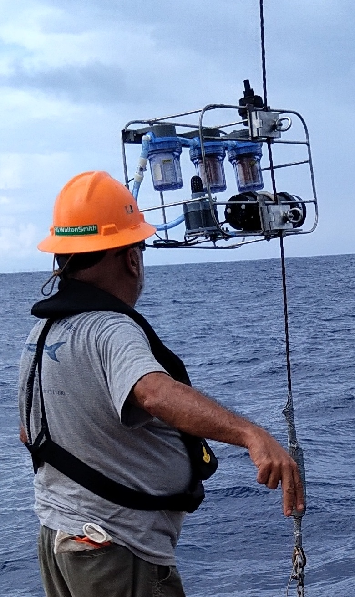
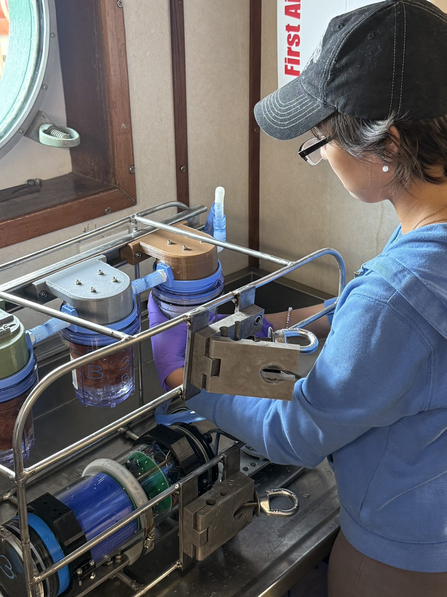

# in_situ_pump
A low cost, open source in situ pump for marine and freshwater sampling.

## Features

## How to Get One

## Hardware
	(drawing)
	(frame)
	(Pump)
	(electronics assembly)
	(filter holder assembly)

## Software

 

## Deployments

### South Florida Test Cruise
|  |  |

## Acknowledgements
This project is supported by the U.S.National Science Foundation (Grant # OCE). We are grateful for technical support and advice provided at Florida International University's Applied research Center (FIU-ARC) from the following individuals: Dr Yipeng He, Theophile Pierre, and Gabriel Cerioni.  Emily Jackson and Sahaira Paz assisted with testing the device and operations on the South Florida cruise. We thank the captain and crew of research vessel F.G. Walton Smith. Emily Jackson and Clint Miller provided photographs.
