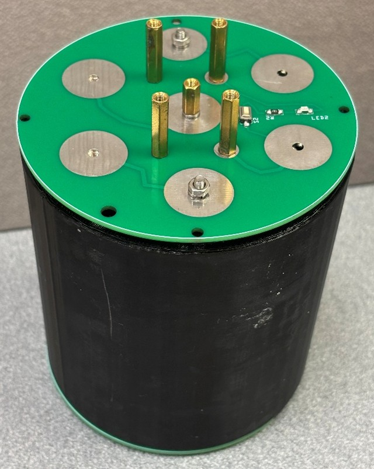
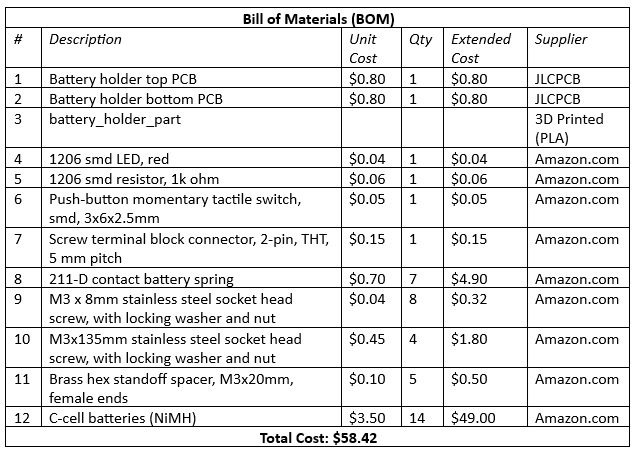
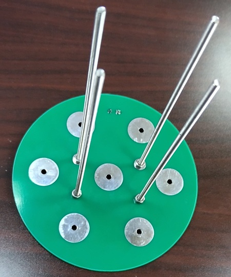
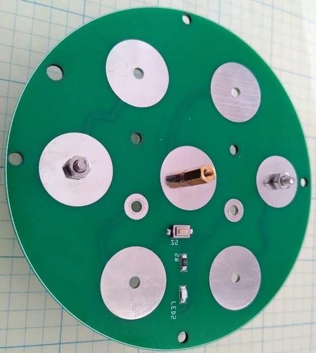
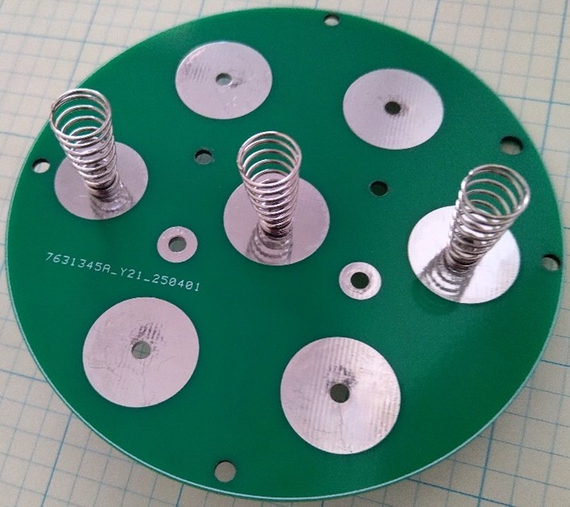
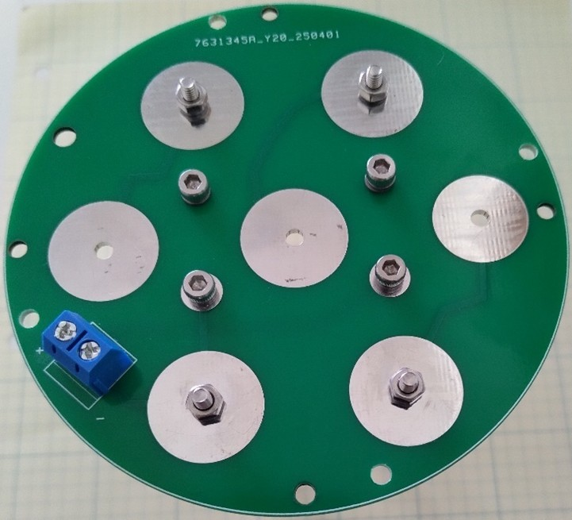
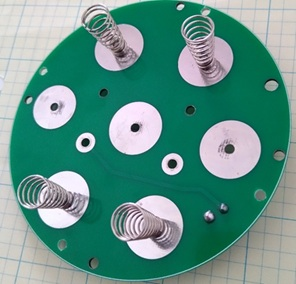
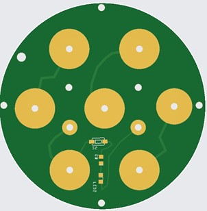
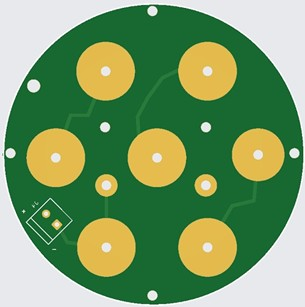
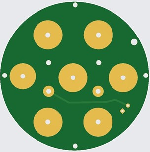

# battery_holder_assembly

The battery_holder_assembly consists of a 3D printed battery holder tube sandwiched between two PCBs (the battery holder top and bottom PCBs). The holder accomodates 14 c-cell batteries.  Alkaline or rechargeable NiMH batteries may be used. The unit is held together by four 135mm stainless steel socket head screws that pass through holes in the PCBs (two blank holes and two vias).  The screws fastened through the vias create a conductive pathway between the top and bottom PCBs.  

<table>
<tr>
<td width=355>

</td>
<td width=355>

</td>
</tr>
<tr>
<td align=center>
battery_holder_assembly top
</td>
<td align=center valign=top>
battery_holder_assembly bottom
</td>
</tr>
</table>

### Assembly (approximate time: 30 minutes): 
1. Assemble the battery holder top and bottom PCBs (scroll down for PCB assembly instructions).
1.	Attach four M3x135 mm socket head screws with washers and nuts through the bottom PCB, as shown in the photo below.

  <table>
    <tr>
      <td>
        
      </td>
    </tr>
    <tr>
      <td align=center>
        Insert 135 mm screws through bottom PCB.
      </td>
    </tr>
  </table>

2.	Pass the screws through the four holes in the battery holder tube and load the tube with 14 C cell batteries.

  <table>
    <tr>
      <td>
        
      </td>
    </tr>
    <tr>
      <td align=center>
        Slide the battery_holder_part over the 135mm screws and insert batteries.
      </td>
    </tr>
  </table>

3. Pass the ends of the 135mm screws through the holes in assembled top PCB and fasten the PCB down using four 20mm brass hex spacers.

### PCB: Battery Holder Top

The assembled batter_holder_top PCB includes a push button and red LED to check for proper assembly and battery strength.

#### Assembly (approximate time: 15 minutes): 
1.	Solder the LED, switch, and resistor to board.
2.	Attach three springs to middle row of conductor pads (i.e., the large vias) using M3x8mm screws, locking washers, and nuts.
3.	For the center hole, an M3x20mm hex brass spacer, used in place of a nut, serves as a handle for removing the PCB during battery replacement.

<table>
<tr>
<td width=355>

</td>
<td width=355>

</td>
</tr>
<tr>
<td align=center>
Battery holder top assembled PCB (front view)
</td>
<td align=center valign=top>
Battery holder top assembled PCB (back view)
</td>
</tr>
</table>

### PCB: Battery Holder Bottom
 	 

The assembled battery_holder_bottom PCB includes a screw terminal block connector for power output to pcb_mainboard and the motor. Four holes along the perimeter of the PCB allow it ot be mounted above pcb_mainboard using brass hex spacers and screws.

#### Assembly (approximate time: 15 minutes): 
1.	Solder the screw terminal to the board.
2.	Attach four springs to conductive pads (i.e., large vias using M3x8mm screws, locking washers, and nuts (see photos below).

<table>
<tr>
<td width=355>

</td>
<td width=355>

</td>
</tr>
<tr>
<td align=center>
Battery holder bottom assembled PCB (front view)
</td>
<td align=center valign=top>
Battery holder bottom assembled PCB (back view)
</td>
</tr>
</table>

### 3D Printed Parts & Gerber Files
We use PLA filament to produce the battery_holder_part. The 3D models (C-cells_105mm) are available in the <a href="3D_Models/">3D Models directory</a>.

Gerber files for PCB production can be found in the <a href="Gerbers/">Gerber files directory</a>

  <table>
    <tr>
      <td>
        
      </td>
    </tr>
    <tr>
      <td align=center>
        battery_holder_part
      </td>
    </tr>
  </table>

<table>
<tr>
<td width=355>

</td>
<td width=355>

</td>
</tr>
<tr>
<td align=center>
Battery holder top PCB (front view)
</td>
<td align=center valign=top>
Battery holder top PCB (back view)
</td>
</tr>
</table>

<table>
<tr>
<td width=355>

</td>
<td width=355>

</td>
</tr>
<tr>
<td align=center>
Battery holder bottom PCB (front view)
</td>
<td align=center valign=top>
Battery holder bottom PCB (back view)
</td>
</tr>
</table>

