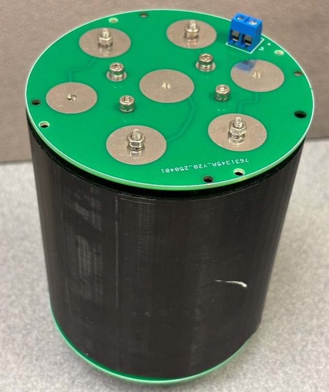
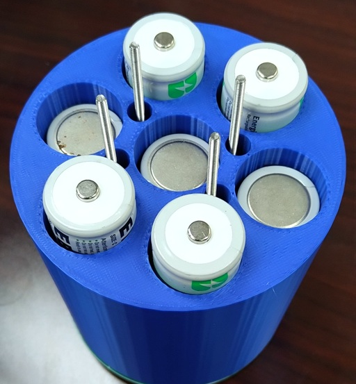

# battery_holder_assembly

The Battery Holder Assembly consists of a 3D printed battery holder tube sandwiched between two PCBs.  It is held together by four brass hex spacers (110 mm) through the blank holes (2) and open vias (2).  The spacers fastened through vias create a conductive pathway between the top and bottom PCBs.  

<table>
<tr>
<td width=355>

</td>
<td width=355>

</td>
</tr>

<tr>
<td align=center>
battery_holder_assembly top
</td>
<td align=center valign=top>
battery_holder_assembly bottom
</td>
</tr>
</table>

### Assembly (approximate time: 20 minutes): 
1.	Attach four M3x135 mm socket head screws with washers through the bottom PCB, as shown in the photo below.

  <table>
    <tr>
      <td>
        
      </td>
    </tr>
    <tr>
      <td align=center>
        Insert 135 mm screws through bottom PCB.
      </td>
    </tr>
  </table>

2.	Pass the hex spacers through battery holder tube and load the tube with 14 C cell batteries.

  <table>
    <tr>
      <td>
        
      </td>
    </tr>
    <tr>
      <td align=center>
        Slide the battery_holder_part over the 135mm screws and insert batteries.
      </td>
    </tr>
  </table>

3.	Screw on the bottom PCB lining up the two conductive screw holes with the ones on the top PCB and fasten them with the 20 mm hex spacers.

### PCB: Battery Holder Top

The assembled Battery Holder Top PCB includes a push button and a red LED to check for proper assembly and battery strength.  The Battery Holder Top PCB can be used in both 4-inch and 5-inch diameter c-cell battery holder assemblies.

#### Assembly (approximate time: 15 minutes): 
1.	Solder the LED, switch, and resistor to board.
2.	Attach three springs to middle row of large vias using screws, locking washers, and nuts.
3.	The 10 mm hex brass spacer is used in place of a nut, and serves as a handle for removing the PCB during battery replacement.

### PCB: Battery Holder Bottom
 	 

PCB: Battery Holder Bottom (front view)	PCB: Battery Holder Bottom (back view)
 The assembled Battery Holder Bottom PCB includes a screw terminal block connector for power output to the Bus Board. The board is physically attached to the Mainboard with brass hex spacers through the four mounting holes. The Battery Holder Bottom PCB can be used in both 4-inch and 5-inch diameter c-cell battery holder assemblies.

#### Assembly (approximate time: 15 minutes): 
1.	Solder the screw terminal to the board.
2.	Attach four springs to large vias (see photos below) using screws, locking washers, and nuts.
3.	
### 3D Printed Parts
We use a PLA filament to produce the battery_holder_part. 

The 3D models for the C-cells battery holder are available in the <a href="3D_Models/">3D Models directory</a>.

  <table>
    <tr>
      <td>
        
      </td>
    </tr>
    <tr>
      <td align=center>
        battery_holder_part
      </td>
    </tr>
  </table>

