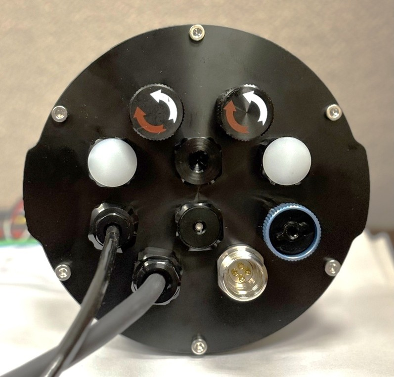

# electronics_assembly
 	 

The Electronics Assembly consists the watertight enclosure with end cap mounted sensors, indicators, and penetrators, and the internal electronic and power components (i.e., assembled PCB and batteries).  The assembly is secured to the frame’s Base Plate with watertight enclosure clamps.

[Note: Alternate Version] The instructions and files here are for the 100mm (4-inch) diameter enclosure.

### Assembly (approximate time: 2 hours):  

[Recommended tools and supplies: Blue Robotics WetLink Bulkhead Wrench, adjustable wrench, bench vise, wire strippers, ratcheting crimping tool for JST connectors]

1. Mount the endcaps to the O-ring sealing flanges using the included face seal O-ring and end cap screws. 
2. Prepare each wire by trimming it to ≈ 10cm, stripping the end, and crimping on a female pin connector.
3. Prepare the Flow sensor wire by removing wires connected to the flow sensor module and replacing them with ≈ 65cm of PUR Subsea 3-conductor cable.

Note: The assembled 3-pin and 4-pin connectors will not fit through the M10 end cap holes. Therefore, it is recommended not to insert the wires into the plastic body until the component or penetrators has been mounted to the end cap.

4. Mount the following components to the M10 x10 hole end cap: WetLink penetrators for the motor and flow sensor, Bar30 pressure sensor, red and green LEDs, two switches, Cobalt bulkhead connector (USB), pressure relief valve, and a blank penetrator.

<table>
<thead>
<tr>
<th width=455>

</th>
</tr>
</thead>

5. Insert each wire into the appropriate JST connector body.  
6. Plug in the following components to the front of the Assembled Mainboard: red and green LEDS, two switches, Bar30 Pressure sensor, Cobalt connector wires (USB connection), Flow sensor, and ESC connector.
7. Insert the ESC power leads (thick red and black wires) into the front screw terminal block, and tighten them down.
8. Solder the banana connectors to the three conductors of the motor cable.  Then apply heat-shrink tubing to the connection.
9. Insert the three banana connector male leads from the E200 motor into the matching female leads from the ESC. 
10. Screw four M3x60mm brass hex spacers into the mounting holes in the sealing flange.

### 3D Printed Parts
We use a 3D printer to produce the battery holder with 100% infill.

The 3D models including .STEP and .STL files are available in the <a href="3D_Models/">3D Models directory</a>.

