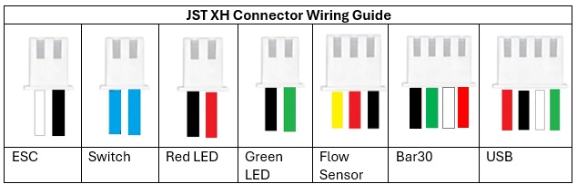
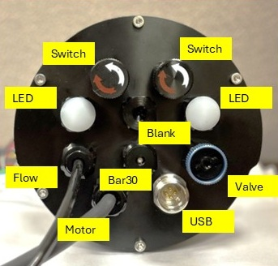

# electronics_assembly
 	 
The electronics_assembly includes PCB_mainboard and the battery_holder_assembly, which are contained within a Blue Robotics watertight enclosure with locking endcaps. Mounted on one end cap are two LED indicators, two switches, and the pressure sensor, as well as penetrators for external components including the M200 motor, USB, and optional flow sensors. The other end cap gives access to the the battery holder.  The assembly is clamped to the frame’s base plate. 

Separate pages give detailed instructions for assembling <a href="pcb_mainboard.md">PCB mainboard</a> and the <a href="battery_holder_assembly.md">battery_holder_assembly</a>.

 

  <table>
    <tr>
      <td align=center>
        
      </td>
    </tr>
    <tr>
      <td align=center>
        electronics_assembly, fully assembled.
      </td>
    </tr>
  </table>

## Assembly (approximate time: 2 hours):  
> [!IMPORTANT]
> **Recommended tools and supplies**: Blue Robotics WetLink Bulkhead Wrench, adjustable wrench, bench vise, wire strippers, and ratcheting crimping tools for JST connectors and wire ferrules.
> 
Separate pages give detailed instructions for assembling <a href="pcb_mainboard.md">PCB mainboard</a> and the <a href="battery_holder_assembly.md">battery_holder_assembly</a>.

1. Attach the endcaps to the O-ring sealing flanges using the included face seal O-ring and end cap screws. 
2. Prepare each wire by trimming it to ≈ 10cm, stripping the end, and crimping on a female pin connector. The plastic JST connector bodies should be attached according to the wiring guide below.

> [!TIP]
> The assembled 3-pin and 4-pin connectors will not fit through the M10 end cap holes. Therefore, it is recommended not to insert the wires into the plastic body until the component or cable penetrator has been mounted to the end cap.

3. Mount the following components to the M10 x10 hole end cap: WetLink penetrators for the motor and flow sensor, Bar30 pressure sensor, red and green LEDs, two switches, Cobalt bulkhead connector (USB), pressure relief valve, and a blank penetrator.

  

  <table>
    <tr>
      <td align=center>
        
      </td>
     <td align=center>
        
      </td>
    </tr>
    <tr>
      <td align=center colspan=2>
        M10 x10 hole end cap with mounted components.
      </td>
    </tr>
  </table>

4. Assemble the PCB_tray using one M3x8mm socket head screw on each end, and attach the assembled PCB_mainboard using M3x8mm screws through the four mounting holes.

  <table>
    <tr>
      <td align=center>
        
      </td>
    </tr>
    <tr>
      <td align=center>
        PCB tray with mainboard PCB.
      </td>
    </tr>
  </table>

5. Screw four M3x10mm brass hex spacers into the mounting holes in the sealing flange, and then attach the PCB_tray to the spacers using M3x8mm socket head screws and locking washers.
6. Plug in the following components to the assembled PCB_mainboard: red and green LEDs, two switches, Bar30 Pressure sensor, Cobalt connector wires (USB connection), Flow sensor, and ESC connector.
7. Insert the ESC power leads (thick red and black wires) into the ESC screw terminal block on the PCB, and tighten the screws down.
8. Solder banana connectors to the three conductors of the motor cable (male) and ESC (female).  Then apply heat-shrink tubing over the connectors.
9. Insert the three banana connector male leads from the M200 motor into the matching color female leads from the ESC.
10. Prepare 10cm lengths of red and black 22 awg wire, strip the ends, and then crimp a ferrule to each wire end.
11. Insert ferrules into screw terminals on the PCB_mainboard (terminal labeled 'Battery') and the assembled battery holder bottom PCB, and tighten down.
12. Attach four M3x10mm brass hex spacers to the PCB_tray end using a nut and locking washer, and then attach the battery holder bottom PCB to the brass spacers using M3x6mm phillips head brass screws.
13. Assemble the rest of the battery_holder_assembly (instructions <a href="battery_holder_assembly.md">here</a>).
14. The assembly can now be inserted into the cylindrical watertight enclosure and locked into place with the provided locking cord.
15. Finally, assemble the blank end cap with its o-ring sealing flange and attach it to the watertight enclosure (note: loosen the pressure valve to insert the flange / end-cap).

  <table>
    <tr>
      <td align=center>
        
      </td>
    </tr>
    <tr>
      <td align=center>
        PCB tray with mainboard PCB.
      </td>
    </tr>
  </table>

  <table>
    <tr>
      <td align=center>
        
      </td>
      <td align=center>
        
      </td>
    </tr>
    <tr>
      <td align=center>
        PCB tray front view.
      </td>
     <td align=center>
        PCB tray rear view.
      </td>
    </tr>
  </table>

### 3D Printed Parts
We print the PCB tray using PLA filament. The 3D model files are available in the [3D models directory](3D_Models/).

  <table>
    <tr>
      <td align=center>
        
      </td>
      <td align=center>
        
      </td>
    </tr>
    <tr>
      <td align=center>
        PCB tray.
      </td>
     <td align=center>
        PCB tray end piece.
      </td>
    </tr>
  </table>

