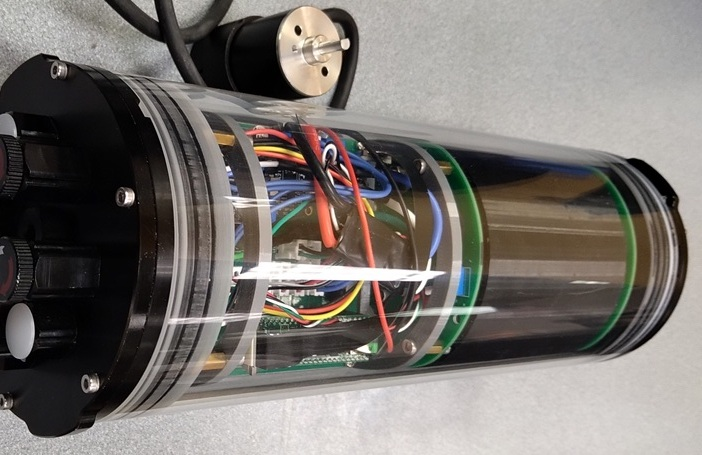
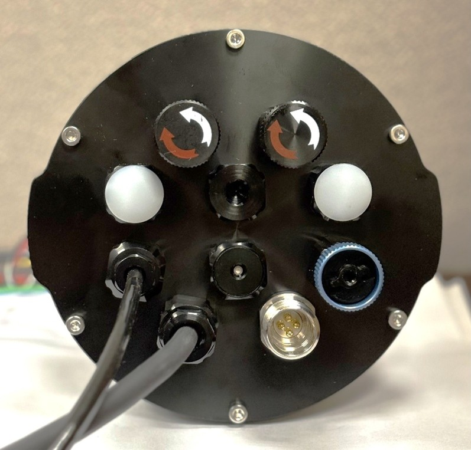
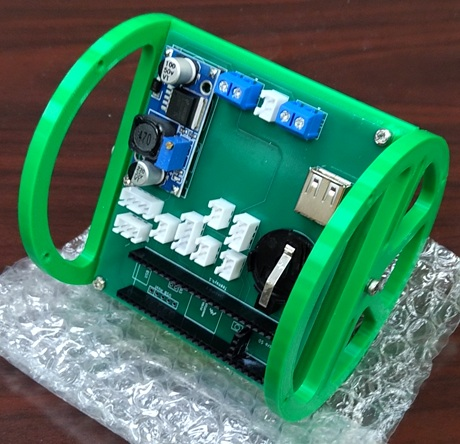
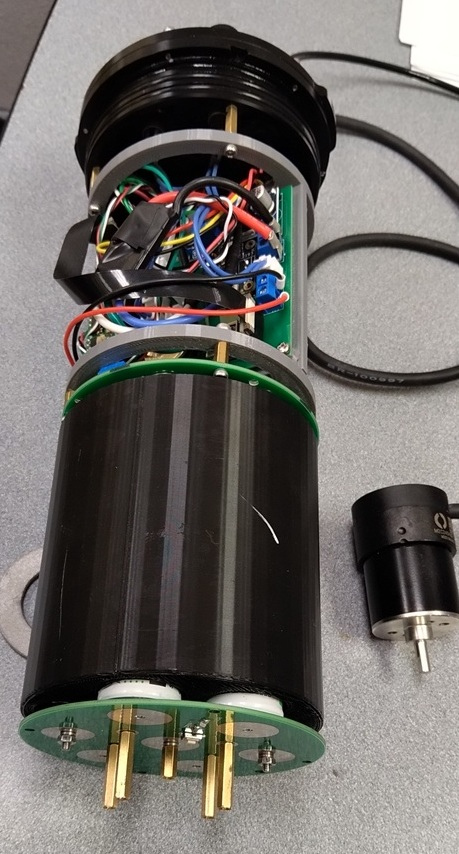
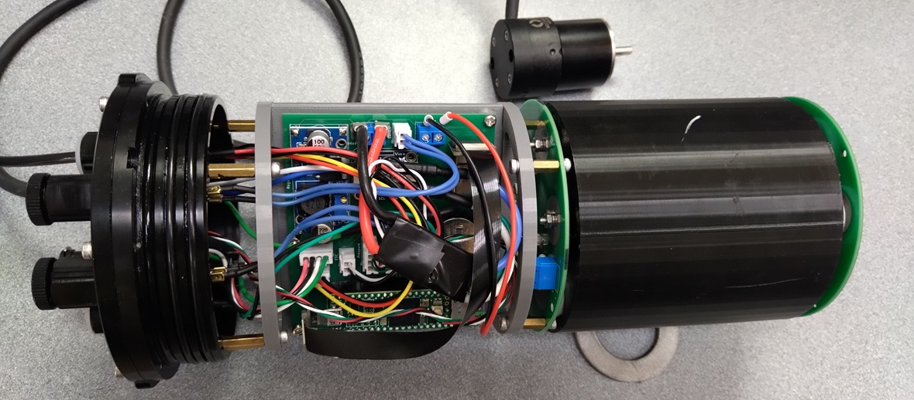
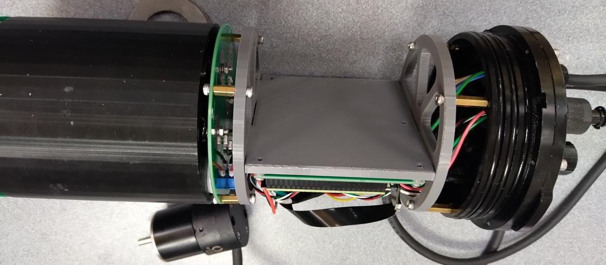
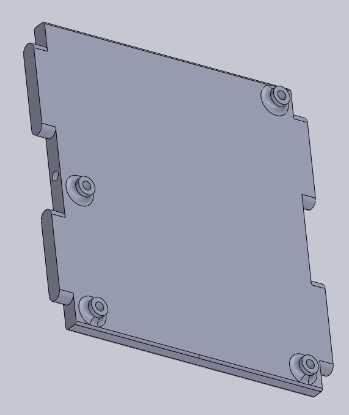
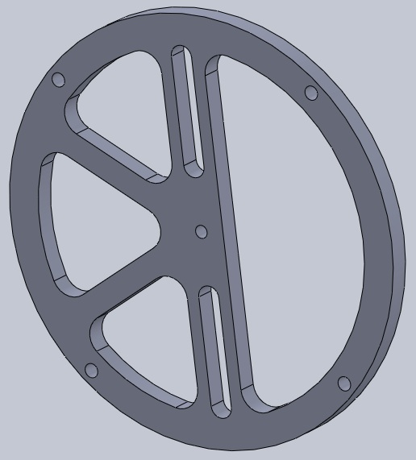

# electronics_assembly
 	 
The electronics_assembly includes PCB_mainboard and the battery_holder_assembly, which are contained within a Blue Robotics watertight enclosure with locking endcaps. Mounted on one end cap are two LED indicators and the pressure sensor, as well as penetrators for external components including the M200 motor, a USB, and optional flow sensors. The other end cap gives access to the the battery holder.  The assembly is clampeed to the frame’s base plate. 

Separate pages give detailed instructions for assembling <a href="pcb_mainboard.md">PCB mainboard</a> and the <a href="battery_holder_assembly.md">battery_holder_assembly</a>.

 

  <table>
    <tr>
      <td align=center>
        
      </td>
    </tr>
    <tr>
      <td align=center>
        electronics_assembly, fully assembled.
      </td>
    </tr>
  </table>

## Assembly (approximate time: 2 hours):  
> [!IMPORTANT]
> **Recommended tools and supplies**: Blue Robotics WetLink Bulkhead Wrench, adjustable wrench, bench vise, wire strippers, ratcheting crimping tool for JST connectors.

1. Mount the endcaps to the O-ring sealing flanges using the included face seal O-ring and end cap screws. 
2. Prepare each wire by trimming it to ≈ 10cm, stripping the end, and crimping on a female pin connector.
3. Prepare the Flow sensor wire by removing wires connected to the flow sensor module and replacing them with ≈ 65cm of PUR Subsea 3-conductor cable.

> [!TIP]
> The assembled 3-pin and 4-pin connectors will not fit through the M10 end cap holes. Therefore, it is recommended not to insert the wires into the plastic body until the component or penetrators has been mounted to the end cap.

4. Mount the following components to the M10 x10 hole end cap: WetLink penetrators for the motor and flow sensor, Bar30 pressure sensor, red and green LEDs, two switches, Cobalt bulkhead connector (USB), pressure relief valve, and a blank penetrator.

  

  <table>
    <tr>
      <td align=center>
        
      </td>
    </tr>
    <tr>
      <td align=center>
        M10 x10 hole end cap with mounted components.
      </td>
    </tr>
  </table>

 
5. Insert each wire into the appropriate JST connector body.  
6. Plug in the following components to the front of the Assembled Mainboard: red and green LEDS, two switches, Bar30 Pressure sensor, Cobalt connector wires (USB connection), Flow sensor, and ESC connector.
7. Insert the ESC power leads (thick red and black wires) into the front screw terminal block, and tighten them down.
8. Solder the banana connectors to the three conductors of the motor cable.  Then apply heat-shrink tubing to the connection.
9. Insert the three banana connector male leads from the E200 motor into the matching color female leads from the ESC. 
10. Screw four M3x60mm brass hex spacers into the mounting holes in the sealing flange.

  <table>
    <tr>
      <td align=center>
        
      </td>
    </tr>
    <tr>
      <td align=center>
        PCB tray with mainboard PCB.
      </td>
    </tr>
  </table>

  <table>
    <tr>
      <td align=center>
        
      </td>
    </tr>
    <tr>
      <td align=center>
        PCB tray with mainboard PCB.
      </td>
    </tr>
  </table>

  <table>
    <tr>
      <td align=center>
        
      </td>
      <td align=center>
        
      </td>
    </tr>
    <tr>
      <td align=center>
        PCB tray front view.
      </td>
     <td align=center>
        PCB tray rear view.
      </td>
    </tr>
  </table>

## Bill of Materials (BOM)
| Item | Cost | Qty | Supplier | Link |
| --- | --- | --- | --- | --- |
| Watertight enclosure tube, 100 mm dia., aluminum | $348.00 | 1 | Blue Robotics | [link](https://bluerobotics.com/store/watertight-enclosures/wte-vp/) |
| O-ring sealing flange, 100 mm dia. | $50.00 | 2 | Blue Robotics | [link](https://bluerobotics.com/store/watertight-enclosures/wte-vp/) |
| End cap, blank, 100 mm dia., aluminum | $34.00 | 1 | Blue Robotics | [link](https://bluerobotics.com/store/watertight-enclosures/wte-vp/) |
| End cap, 10 X M10 holes, 100 mm dia., aluminum | $42.00 | 1 | Blue Robotics | [link](https://bluerobotics.com/store/watertight-enclosures/wte-vp/) |
| Pressure relief valve | $32.00 | 1 | Blue Robotics | [link](https://bluerobotics.com/store/watertight-enclosures/wte-vp/) |
WetLink penetrator, blank, M10 thread | $6.00 | 1 | Blue Robotics | [link](https://bluerobotics.com/store/cables-connectors/wlp-blank/) |
| Switch | $28.00 | 2 | Blue Robotics | [link](https://bluerobotics.com/store/comm-control-power/switch/switch-10-5a-r1/) |
| Subsea LED indicator, red | $17.00 | 1 | Blue Robotics | [link](https://bluerobotics.com/store/thrusters/lights/indicator10-asm-r1/) |
| Subsea LED indicator, green | $17.00 | 1 | Blue Robotics | [link](https://bluerobotics.com/store/thrusters/lights/indicator10-asm-r1/) |
| Bar30 pressure sensor | $90.00 | 1 | Blue Robotics | [link](https://bluerobotics.com/store/sensors-cameras/sensors/bar-depth-pressure-sensor/) |
| Cobalt series bulkhead connector, 4-pin | $55.00 | 1 | Blue Trail Engineering | [link](https://www.bluetrailengineering.com/product-page/cobalt-series-bulkhead-connector) |
| JST XH-2P connector plug, female (2-pin) | ≈$0.03 | 4 | Amazon | [link](https://www.amazon.com/Taiss-560PCS-Connector-Adapter-Housing/dp/B09ZTWCZ3K/ref=sr_1_8?dib=eyJ2IjoiMSJ9.Cn4hX633kPB8Js4XMjA2RhvX9VC8ewI_tuuVkRBEkojSjszEqicyEJ84RZg8N41hu2s_P49O1PIi1srQVcVrlHzU-aHzVICenj-Asco0gGkutb7iFo5Mrn2psDZqCjd25rUo0X-3OBhv8cwI7iZtTTf52qMG_66mrZ8d6WuvOCvjK5C_IAykJ8aDHAWcLGOMiawp7A9BTjQXv7cmk4WJQApB_U8tsqHLkCvfVy7TBFs._GEpvkVpeF0oebLlzUCCAJl0pclV2ClTSpZ3UR9t8w0&dib_tag=se&keywords=JST%2BXH&qid=1768590186&sr=8-8&th=1) |
| JST XH-4P connector plug, female (4-pin) | ≈$0.03 | 2 | Amazon | [link](https://www.amazon.com/Taiss-560PCS-Connector-Adapter-Housing/dp/B09ZTWCZ3K/ref=sr_1_8?dib=eyJ2IjoiMSJ9.Cn4hX633kPB8Js4XMjA2RhvX9VC8ewI_tuuVkRBEkojSjszEqicyEJ84RZg8N41hu2s_P49O1PIi1srQVcVrlHzU-aHzVICenj-Asco0gGkutb7iFo5Mrn2psDZqCjd25rUo0X-3OBhv8cwI7iZtTTf52qMG_66mrZ8d6WuvOCvjK5C_IAykJ8aDHAWcLGOMiawp7A9BTjQXv7cmk4WJQApB_U8tsqHLkCvfVy7TBFs._GEpvkVpeF0oebLlzUCCAJl0pclV2ClTSpZ3UR9t8w0&dib_tag=se&keywords=JST%2BXH&qid=1768590186&sr=8-8&th=1) |
| 22 AWG silicone insulated wire | $13.69 | 1 | Amazon | [link](https://www.amazon.com/Electrical-Wire-XINWANG-Stranded-Silicone-Insulation/dp/B0B15HCLT6/ref=sr_1_4_sspa?crid=3670ZMZ101R6F&dib=eyJ2IjoiMSJ9.cj0q-7qcpj9r_Jo1srZ8okwmEUnJrkIh9OXYYqhHg3LBRDAXzmOfZg153eWQqHciRg63eY2jh0TpN26vqU32Okge8pGj5V8cJgrFnnvxrg584fawEmgtS--xQ5jlqJMdPVU3kcy6vucKwg7gOZivuGZ5Dc01OpYDkr9IYZZqbaTVfjL9zIFNVlblVLMFZpubVA1khCQTYCCu7qBO_f7-eqcydQyuZv40cBdaVXE0erSc9Q5jb6f5oXPjo5BeOhv9KeYFvDVP7Q5a6sbmWGpuaYTwkWvvmVK3nmAPfPa91Is.WxZgr0UHXF0T7kh7k3tOfkhoNIFbUaVwN3Hba4T5k7Q&dib_tag=se&keywords=xinwang%2B22%2BAWG%2Bwire&qid=1768590715&sprefix=xinwang%2B22%2Bawg%2Bwire%2Caps%2C154&sr=8-4-spons&sp_csd=d2lkZ2V0TmFtZT1zcF9hdGY&th=1) |
| USB-A to Micro USB cable, 15 cm, 90° angled up | $13.00 | 1 | Amazon | [link](https://www.amazon.com/dp/B07X2YT896/ref=sspa_dk_detail_0?pd_rd_i=B07X2YT896&pd_rd_w=P8Lhv&content-id=amzn1.sym.386c274b-4bfe-4421-9052-a1a56db557ab&pf_rd_p=386c274b-4bfe-4421-9052-a1a56db557ab&pf_rd_r=94K23EYQVS1D8EYC7296&pd_rd_wg=n6RpU&pd_rd_r=80757863-58df-429e-acd3-e17dd4222cc8&sp_csd=d2lkZ2V0TmFtZT1zcF9kZXRhaWxfdGhlbWF0aWM&th=1) |
| C-cell batteries | ≈$1.50 | 14 | Amazon | [link](https://www.amazon.com/s?k=c-cell+batteries&i=electronics&crid=32KG87ENDWNR&sprefix=c-cell+batteries%2Celectronics%2C174&ref=nb_sb_noss_1) |
| Flow Sensor Turbine Flowmeter | $4.98 | 1 | Amazon | [link](https://www.amazon.com/JESSINIE-YF-S201C-DC3-5-24V-Transparent-Flowmeter/dp/B0C1C1P187/ref=sr_1_2?crid=2JBP4UUD45MV9&dib=eyJ2IjoiMSJ9.g7kpQZPVmlmSBIVS-Za0ciaBUYTXBye5Mv9Olq5ii91JCwbaiySpIe4Gh-1CB3StVYTRMyAyO8OdJBjKVLqCu2d92WV0QZksPjcpPaR35Mb1QUoIlBL7ys1tmE6NqvAxOmAeU4MdMX7h-7VFSkNXcvyh-k-nzmhYInt3jYuFNS7FJ8EO4KKKazJX7PY7M2spdJHLdKYcUYXYZJZv_MMYWeIpPnb_DBjrVeGSk4TF4Bc.dD4FA1eNrDPvV3u1ucSdcKCwtUJXT-eZyXujCQMWy3k&dib_tag=se&keywords=jessinie+flow+sensor&qid=1768591820&sprefix=jessinie+flow+sensor%2Caps%2C101&sr=8-2) |
| PUR Subsea Cable-Lumen/Gripper Cable (3 conductor, 22 AWG) | $16.00/meter | 1 meter | Amazon | [link](https://bluerobotics.com/store/cables-connectors/pur-subsea-cable/) | 
| M200 Motor | $185.00 | 1 | Blue Robotics | [link](https://bluerobotics.com/store/thrusters/t100-t200-thrusters/m200-motor/) |
| Brass screws, M3 x 6mm, Phillips head | $0.27 | 8 | Amazon | [link](https://www.amazon.com/uxcell-Phillips-Furniture-Equipment-Electronics/dp/B09Q38GZZN/ref=sr_1_4?crid=184BPVP9BNG1X&dib=eyJ2IjoiMSJ9.IJBHP2rq4AgtLDN5oCl3AqGy7Fn1tZ0wmTOkkxnrgDoZ7vmkiMG14kHNul4D1-zs7FEJGRJI56RaWLy9OuyneusVexQEthUGzvTqvXdkvoK-Pw0g2u0iVn-eD-KT2lxZjyLjXE3EDFa6dGPl0kRmASWwVlYvvzjE3TfJg4Bqyuu-XSBbVvYIjY8mMq03rzz_LhWSI-fOI8jv9TBVCWmjmneigjf4mchOVRVOXFBH3ug.E5GpUrekTRD00vy6FVN9tfq20SI3UdUhF-DyMozzXBA&dib_tag=se&keywords=brass%2Bscrews%2C%2Bm3%2Bx%2B6mm%2C%2Bphillips%2Bhead&qid=1768593983&sprefix=%2Caps%2C125&sr=8-4&th=1) |
| Wire Ferrules Terminals | ≈$0.01 | 4 | Amazon | [link](https://www.amazon.com/Fidioto-Terminals-Connector-Insulated-Industrial/dp/B0CN13VRD3/ref=sr_1_5_sspa?crid=3GBGEKZEJ5P3&dib=eyJ2IjoiMSJ9.JGGEuEFkSuGA9e78r39gqa48UTbvyJxJBm1Fa9CksSAkYlOsQSTFNwN8GF1iajj3TCudcbM8b3cGIsYh2KAi4-NaIOPq1IfNeKS50liACwbENH0kt3VwYD_bm10zz6FsdoYpH2vtlh1mP194CfZeQzRFzD7ykqUngn3hzGUsixqJeBlVvnKi33mrnUdJyBbmznwtlsgvqTgw-FezQcGJZAmDfbGY9A8cdgOWxOF8pBA.IKKG6BqB3j2W_g_Cihp-V9lrgCpLSynObZT4j7-tOS0&dib_tag=se&keywords=wire%2Bferrules&qid=1768593714&sprefix=wire%2Bferr%2Caps%2C154&sr=8-5-spons&sp_csd=d2lkZ2V0TmFtZT1zcF9tdGY&th=1) |

| Total Cost: |
| --- |

### 3D Printed Parts
We print the PCB tray using PLA filament. The 3D model files are available in the [3D models directory](3D_Models/).

  <table>
    <tr>
      <td align=center>
        
      </td>
      <td align=center>
        
      </td>
    </tr>
    <tr>
      <td align=center>
        PCB tray.
      </td>
     <td align=center>
        PCB tray end piece.
      </td>
    </tr>
  </table>

