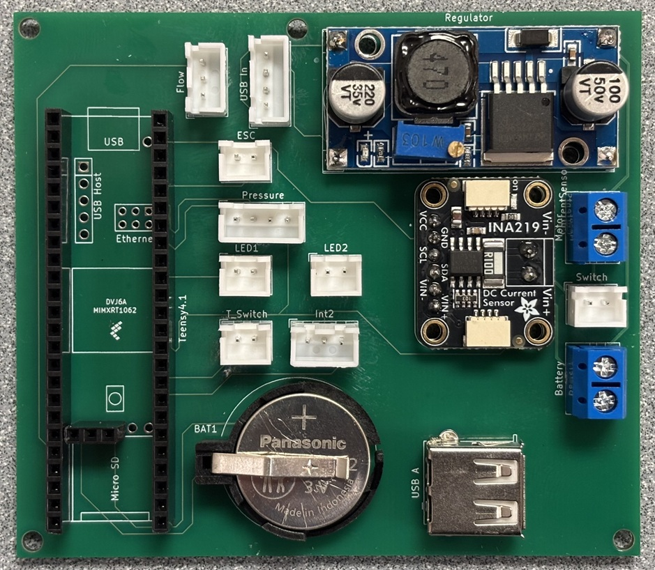
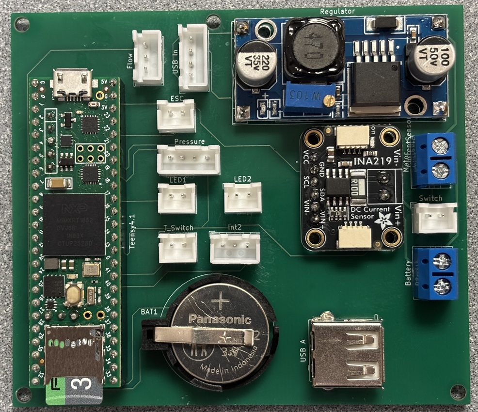

# pcb_mainboard
 	 
pcb_mainboard contains the [Teensy 4.1](https://www.pjrc.com/store/teensy41.html) microprocessor and connections for external components including the motor electronic speed controller (ESC), pressure sensor, switches and LEDs, and the USB port. A Buck converter module regulates the voltage supplied to Teensy (5V). A coin cell battery holder powers Teensy’s real time clock (RTC) when the unit is powered down. Teensy’s built-in microSD card slot allows for data logging. Optional components include an INA219 current sensor (to monitor amps consumed by the motor) and two Hall effect flowmeter connections. pcb_mainboard is mounted on the pcb_tray_part via four mounting holes.  

<table>
<tr>
<td width=400>

</td>
<td width=400>

</td>
</tr>
<tr>
<td align=center>
Assembled pcb_mainboard
</td>
<td align=center valign=top>
Assembled pcb_mainboard with with Teensy 4.1
</td>
</tr>
</table>

## Assembly (approximate time: 30 minutes):  
> [!IMPORTANT]
> * Refer to the photos above to ensure components are oriented correctly.

1.	Solder pin headers for Teensy 4.1 to the PCB.
2.	Solder battery holder, JST-XH connectors, screw terminal block connectors, voltage regulator, USB-A socket, and current sensor (optional) to the PCB.
3.	Using an external power supply or the battery_holder_assembly to power to the Buck converter, adjust the output to 5V.
4.	Insert Teensy 4.1 with Micro SD into headers.
5.	Connect the USB-A socket to Teensy's microUSB socket using the ribbon USB cable.
6.	Insert coin battery.

### Gerber files
Gerber files for PCB production can be found in the <a href="Gerbers/">Gerber files directory</a>.

<table>
<tr>
<td width=355>

</td>
<td width=355>

</td>
</tr>
<tr>
<td align=center>
PCB mainboard with current sensor
</td>
<td align=center valign=top>
PCB mainboard without current sensor
</td>
</tr>
</table>

