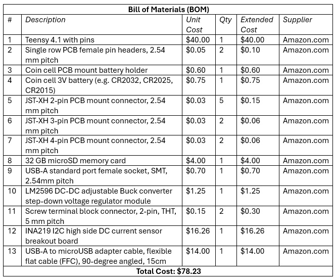
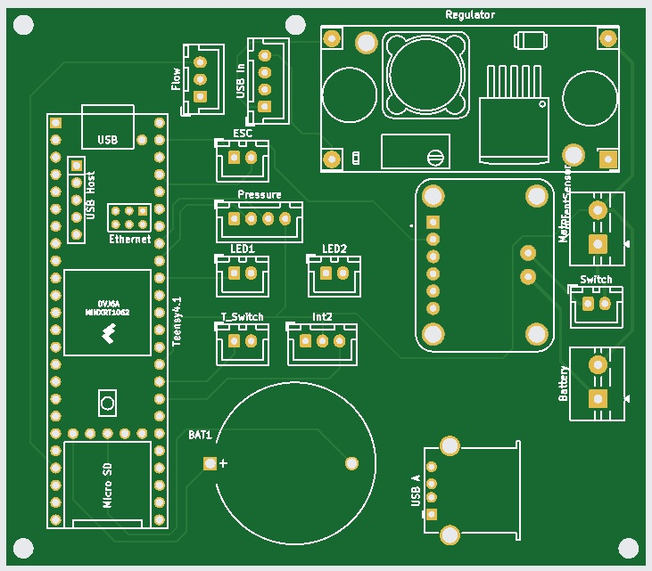
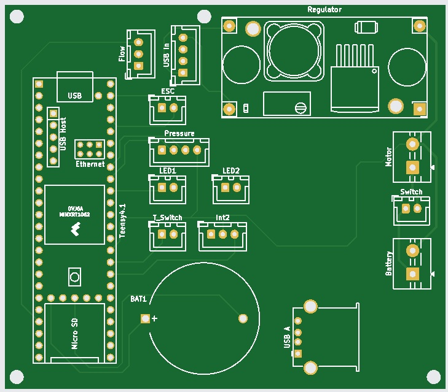

# pcb_mainboard
 	 
The Mainboard contains the [Teensy 4.1](https://www.pjrc.com/store/teensy41.html) microprocessor unit and direct connections for components including, PWM signal to the BLDC motor electronic speed controller (ESC), input from the flow sensor (Flow), pressure sensor (Pressure), and current sensor (Current Sensor), and output to the red LED indicating ready to run (LED1) and to the green LED indicating the start timer (LED2). A coin cell battery holder (BAT1) allows Teensy’s RTC to keep time while the unit is disconnected from external power. Teensy’s built-in microSD card allows for data logging. Teensy’s microUSB adapter is connected to a USB-A connector on the Mainboard, allowing external connection to a PC via the bulkhead connector on the end cap. The Mainboard is mounted on a tray between the end cap and Battery Holder Bottom with brass spacers through the four mounting holes.

> [!NOTE]
> Pins Int2 is unused as of the pump’s current state.

## Assembly (approximate time: 30 minutes):  
> [!IMPORTANT]
> * Solder pins onto all four vias on back side of voltage regulator.
> * Remove terminal block included in current sensor and replace with pins, and solder the other six pins onto the remaining vias.
> * All components mount to the top of the Mainboard.

1.	Insert pin headers, battery holder, JST-XH connectors, screw terminal block connectors, voltage regulator, and current sensor to PCB board.
2.	Solder all pins.
3.	Insert Teensy 4.1 with Micro SD into headers.
4.	Insert coin battery.

### Gerber files
Gerber files for PCB production can be found in the <a href="Gerbers/">Gerber files directory</a>.

<table>
<tr>
<td width=355>

</td>
<td width=355>

</td>
</tr>
<tr>
<td align=center>
PCB mainboard with current sensor
</td>
<td align=center valign=top>
PCB mainboard without current sensor
</td>
</tr>
</table>

