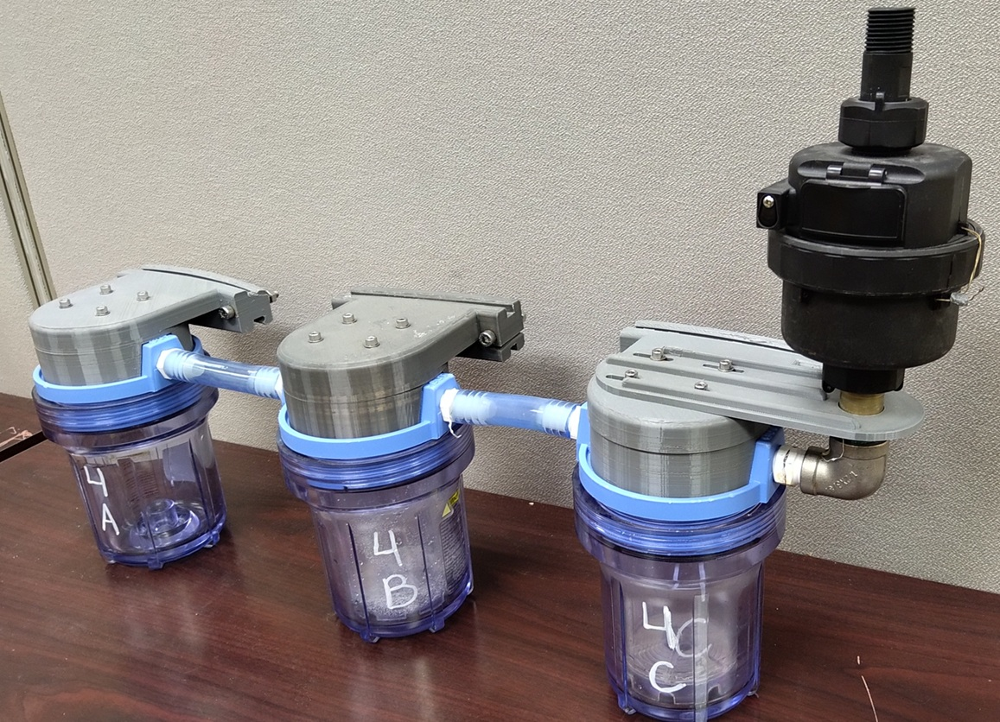
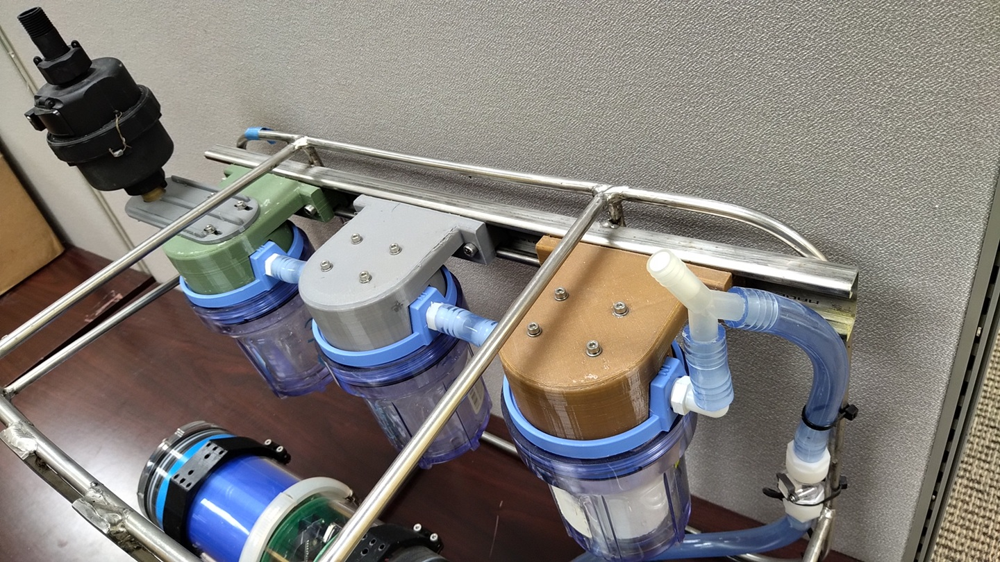
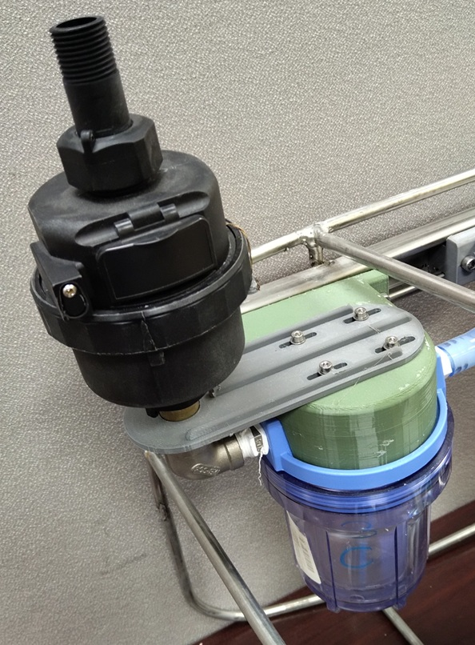
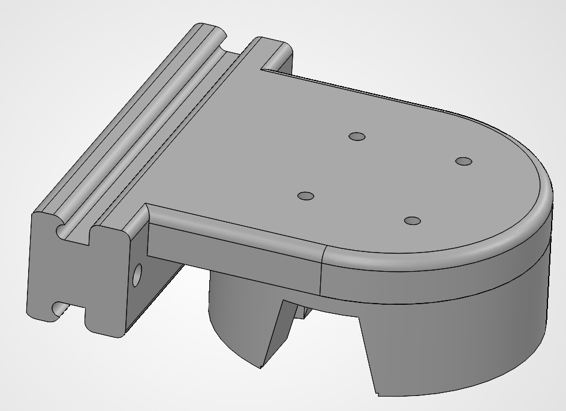
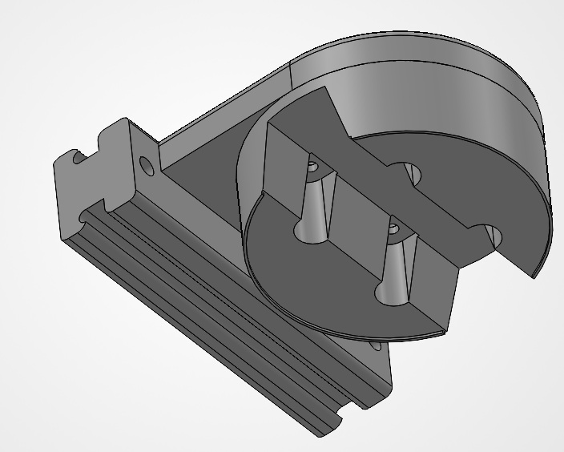

# filter_holder_assembly
The filter_holder_assembly provides a way to secure the filter holders to the frame_assembly. 

Our setup, designed for Beryllium-7 sampling, includes three <a href="https://www.pentair.com/en-us/water-treatment-components/filter-housings/traditional_slim_line_series.html">Pentek Slim Line 5-inch filter holders</a> in series. The first holder contains a 1-micron drop-in water filter to capture particulates, and the next two holders contain iron-impregnated acrylic fibers contained within refillable filter cartidges sold by <a href="https://www.bulkreefsupply.com/mini-brs-reactor-refillable-cartridge-hard-shell.html">Bulk Reef Supply</a>. Seawater is pushed through the three filters by the pump_unit_assembly and exits through a mechanical flow meter from <a href="https://assuredautomation.com/WM-PD/">Assured Automation</a>.

The design is readily adaptable to accomodate other sampling needs. For example, the suction end of the pump_unit_assembly can be attached to the end of the filter series to pull rather than push water through the filters. It can also be adapted for other filter types (e.g. GF/F) and filter holders.

   <table>
      <tr>
         <td></td>
         <td></td>
      </tr>
       <tr>
         <td>filter_holder_assembly Full view</td>
         <td>filter_holder_assembly mounted to frame_assembly</td>
      </tr>
   </table>
   

### Assembly (approximate time: 30 minutes)
1.	Expand the filter holder mounting holes diameter to accommodate the self-tapping thread inserts using a ¼-inch drill bit to a minimum depth of 10 mm (four holes per filter holder). Then screw in the self-tapping inserts until flush with top of filter holder.
2.	For the first two filter holders in series:  First, screw four plastic barbed hose fittings into the filter holder inlets / outlets using Teflon thread-sealing tape as shown in photo above. Then, attach the filter holders to filter_holder_mount_parts using M4x40 mm stainless steel socket head screws and washers (four screws for each holder).
3.	For the third filter holder: First, screw the straight, stainless steel male connector into the female elbow reducer, and screw the straight connector into the filter holder outlet using Teflon tape. Next, align the slots in the flow_meter_anti_rotation_bracket_part with the mounting holes in the filter_holder_mount_part, then attach those parts to the filter holder using four M4x40 mm screws and washers. Finally, attach the flowmeter to the elbow reducer (the flowmeter should be mounted vertically). See photo below.
4.	The filter holders can now be attached in series using vinyl tubing and mounted to the strut channel of the frame_assembly using six M6x45 mm stainless steel socket head screws, split washers, and hex nuts.
5.	Then, use vinyl tubing to connect the outlet of the pump_unit_assembly to the inlet of the first filter holder (barbed fittings on each).
   

  <table>
<tr>
  <td align=center>
  </td>
</tr>
    <tr>
  <td align=center>Close-up showing position of flowmeter_anti_rotation_bracket_part.
  </td>
</tr>
  </table>

### 3D Printed Parts
We use PETG filament with 100% infill to produce the filter_holder_mount_parts and the flow_meter_anti_rotation_bracket_part. 

The 3D models including .STEP and .STL files are available in the <a href="3D_models/">3D Models directory</a>.

  <table>
    <tr>
      <td>
        
      </td>
      <td>
        
      </td>
    </tr>
    <tr>
      <td align=center colspan=2>
        filter_holder_mount_part
      </td>
    </tr>
  </table>

  <table>
    <tr>
      <td>
        
      </td>
    </tr>
    <tr>
      <td align=center>
        flow_meter_anti_rotation_bracket_part
      </td>
    </tr>
  </table>

