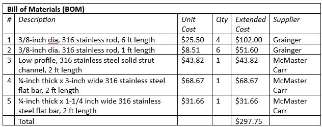
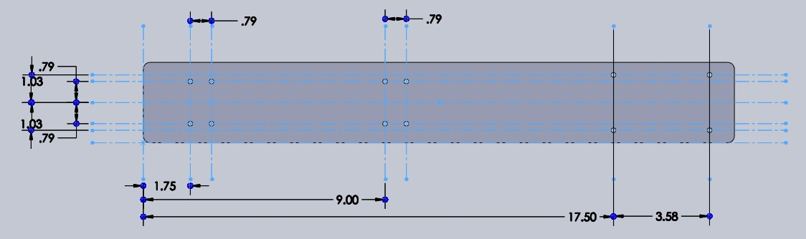

# frame_assembly

The frame, or cage, is constructed of welded 3/8-inch diameter corrosion resistant 316 stainless 
steel rods.  Attached to this structure are a) a ¼-inch thick stainless-steel plate for mounting the 
watertight enclosure and pump unit, b) a stainless-steel strut channel for mounting the filter 
holders, and c) four ¼-inch thick stainless plates for mounting the wire clamps.  The dimensions of 
the frame are 24 x 12 x 16 inches.

<table>
  <tr>
    <td></td>
  </tr>
  <tr>
    <td align=center>frame_assembly</td>
  </tr>
 </table>

### Assembly (approximate time: 4 hours):  
1. Prepare stainless steel rod members (dimensions given in figure below).  Bends are 3
inch radius. Grind ends to a point for welding. 
2. Weld members according to figures.
<table>
  <tr>
    <td></td>
  </tr>
  <tr>
    <td align=center>frame_assembly</td>
  </tr>
 </table>
3. Place 12 x M4 clearance holes in stainless steel base plate as shown in figure below. 
Weld the base plate to two lower cross members.

  <table>
  <tr>
    <td></td>
  </tr>
  <tr>
    <td align=center>Sketch of base plate with M4 clearance hole placement.</td>
  </tr>
 </table>
4. Place 8x M6 clearance holes for filter holder mounts in strut channel as shown in figure 
below. Weld the channel to four vertical rods at back of frame.
<table>
  <tr>
    <td></td>
  </tr>
  <tr>
    <td align=center>frame_assembly</td>
  </tr>
 </table>
5. Prepare the wire clamp mounts by cutting the ¼-inch by 1-inch stainless steel plate into 
5-inch lengths (4 pieces needed). Place two M10 clearance holes in each of the four wire 
clamp mounts as shown in figure below. Weld each mount to two horizontal rod 
members as shown in figure above.
<table>
  <tr>
    <td></td>
  </tr>
  <tr>
    <td align=center>frame_assembly</td>
  </tr>
 </table>
