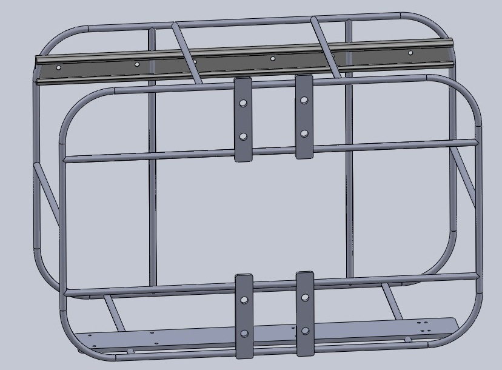
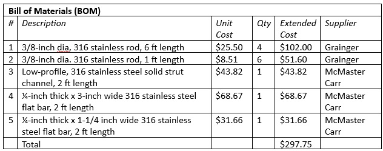
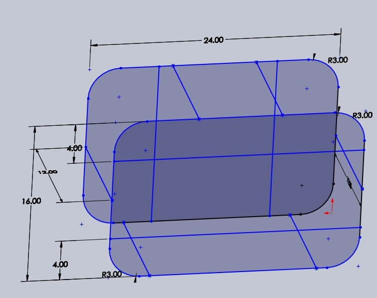
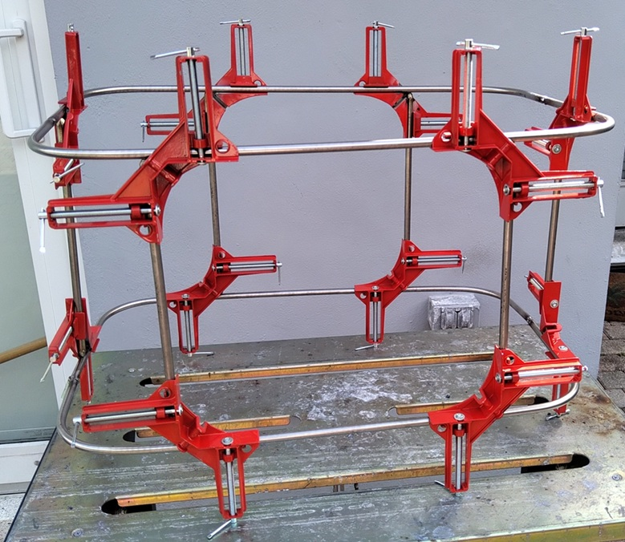
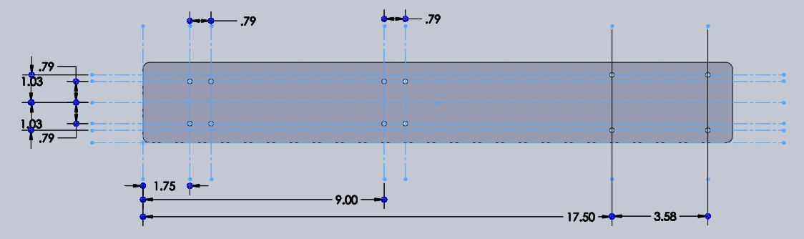
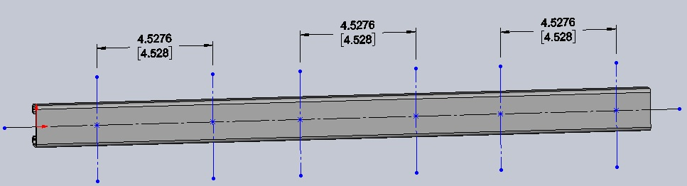
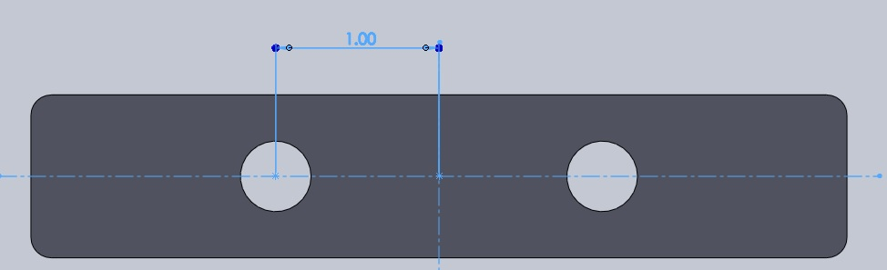

# frame_assembly

The frame, or cage, is constructed of welded 3/8-inch diameter corrosion resistant 316 stainless 
steel rods.  Attached to this structure are a) a ¼-inch thick stainless-steel plate for mounting the 
watertight enclosure and pump unit, b) a stainless-steel strut channel for mounting the filter 
holders, and c) four ¼-inch thick stainless plates for mounting the wire clamps.  The dimensions of 
the frame are 24 x 12 x 16 inches.

<table>
  <tr>
    <td></td>
  </tr>
  <tr>
    <td align=center>frame_assembly</td>
  </tr>
 </table>

### Assembly (approximate time: 4 hours):  
1. Prepare stainless steel rod members (dimensions given in figure below).  Bends are 3
inch radius. Grind ends to a point for welding. 
<table>
  <tr>
    <td></td>
  </tr>
  <tr>
    <td align=center>Sketch of frame showing dimensions (inches) of 3/8-inch stainless steel rod members.</td>
  </tr>
 </table>
2. Weld members according to figures.
<table>
  <tr>
    <td></td>
  </tr>
  <tr>
    <td align=center>Stainless steel rods clamped for welding.</td>
  </tr>
 </table>
3. Trim the 3 x 24 inch stainless steel flat bar down to 22-inches in length.  Then place 12 x M4 clearance holes in the stainless steel base plate as shown in the figure below. The eight holes on the left are for mounting the two watertight enclosure clamps, and the four holes on the right are for mounting the pump_unit. Next, polish the plate with a flap disk, and then weld the base plate to two lower cross members.

  <table>
  <tr>
    <td></td>
  </tr>
  <tr>
    <td align=center>Sketch of base plate with M4 clearance hole placement.</td>
  </tr>
 </table>
4. Place 8x M6 clearance holes for filter holder mounts in strut channel as shown in figure 
below. Weld the channel to four vertical rods at back of frame.
<table>
  <tr>
    <td></td>
  </tr>
  <tr>
    <td align=center>Sketch of strut channel with placement of M6 holes for filter holder mounts. </td>
  </tr>
 </table>
5. Prepare the wire clamp mounts by cutting the ¼-inch by 1 1/4-inch stainless steel plate into 
5-inch lengths (4 pieces needed). Place two M10 clearance holes in each of the four wire 
clamp mounts as shown in figure below. Weld each mount to two horizontal rod 
members as shown in figure above.
<table>
  <tr>
    <td></td>
  </tr>
  <tr>
    <td align=center>Sketch of wire clamp mount with M10 clearance hole placement.</td>
  </tr>
 </table>
