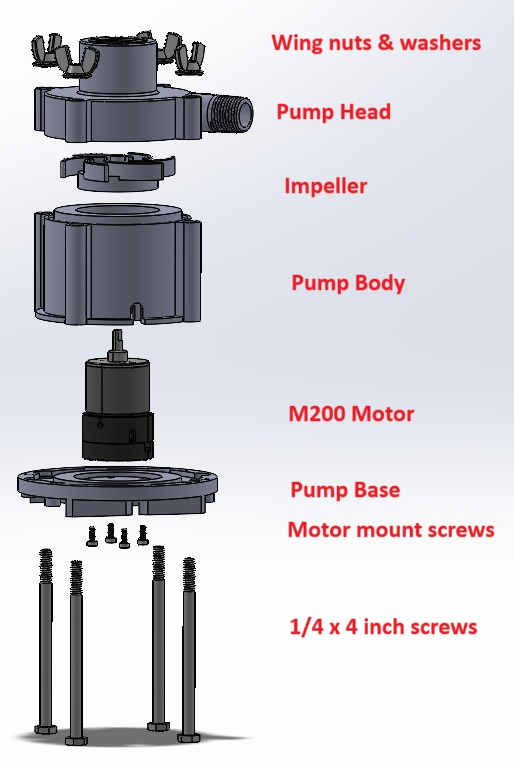
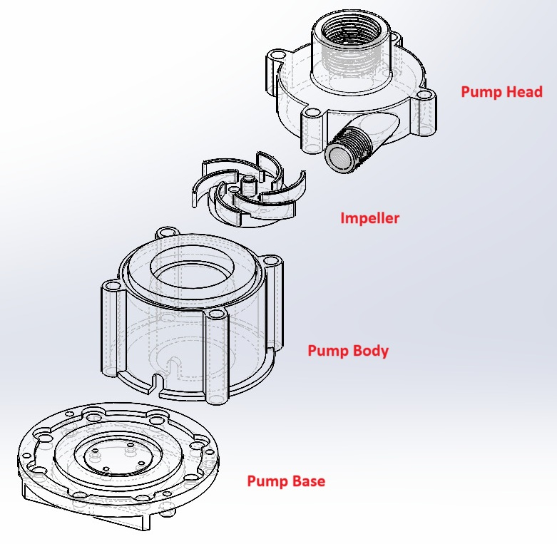
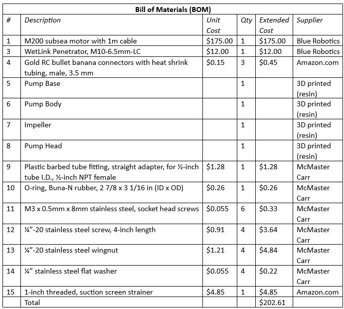

# pump_unit
 	 

The pump_unit consists of a <a href="https://bluerobotics.com/store/thrusters/t100-t200-thrusters/m200-motor/">Blue Robotics M200 subsea motor</a> and 3D printed pump components (<I>pump_base</I>, <I>pump_housing</I>, <I>pump_impeller</I>, and <i>pump_head</i>).  The motor is powered by the 14-cell battery pack and controlled by <a href="https://www.pjrc.com/store/teensy41.html">Teensy 4.1</a> via the <a href="https://bluerobotics.com/store/thrusters/speed-controllers/besc30-r3/">Blue Robotics Basic ESC</a>, all of which are contained within the watertight enclosure.  A <a href="https://bluerobotics.com/store/cables-connectors/penetrators/wlp-vp/?attribute_bulkhead-size-seal-size-plug-compression-compatible-cable-diameter=M10+-+6.5+mm+-+LC+-+6.5+mm+%C2%B1+0.3+mm">Blue Robotics WetLink Penetrator</a> links the external motor with the internal power source.  The pump_unit is secured to the frame_baseplate with four M4 stainless steel screws.

<table>
<thead>
<tr>
<th width=305>

</th>
<th width=455>

</th>
</tr>
</thead>

<tr>
<td align=center>
pump_unit - Exploded View 
(Not shown: power cord, strainer, impeller screws, & O-ring)
</td>
<td align=center valign=top>
pump_unit 3D Printed Parts
</td>
</tr>
</table>

### Assembly (approximate time: 20 minutes):  
1. Assemble the WetLink Penetrator with the motor cable following the instructions on the 
Blue Robotics website. 
2. Solder the banana connectors to the three conductors of the motor cable.  Then apply 
heat shrink tubing to the connections. 
3. Attach the motor to pump_base with four M3 x 8mm screws. 
4. Place the pump_body over the motor. 
5. Attach impeller to motor with two M3 x 8mm screws. 
6. Insert O-ring into groove in pump_body. 
7. Seat the pump_head over the pump_impeller and onto pump_body. 
8. Secure pump_head to pump_base with four sets of ¼ inch screws, washers, and 
wingnuts. 

### 3D Printed Parts
We use a resin printer to produce the pump_unit parts. We have also had success using water resistant filaments, such as PETG, with 100% infill.

The 3D models including Solidworks and .STL files are available in the <a href="3D_models/">3D Models directory</a>.

