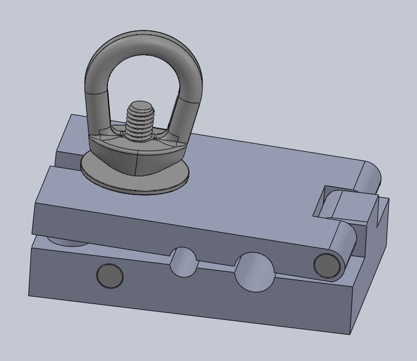
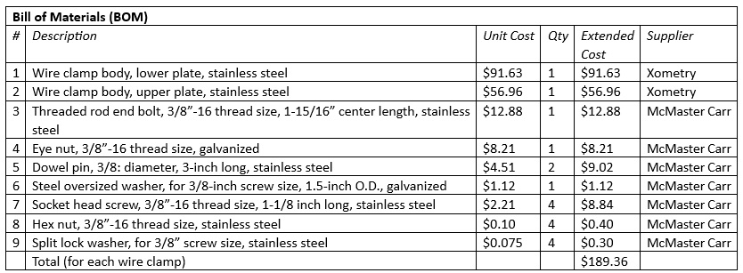

# wire_clamp 

Two wire clamps are used to attach the frame to the hydro wire for deployment.  The book 
clamp design consists of an upper and lower plate that are hinged using a stainless-steel dowel.  
Clamping force is applied by rotating the eye nut onto the threaded rod end bolt.  The design 
includes grooves for two wire sizes (1/4 and 3/8 inch).  The dimensions of the clamp body are 3 
x 4.5 x 1.25 inches.  The clamps are attached to the wire clamp mounts on the frame with four 
3/8”-16 stainless steel socket head screws and hex nuts.

<table>
<tr>
<td width="50%">

</td>
<td width="50%">

</td>
</tr>

<tr>
<td span=2 align=center>
wire_clamp, Solidworks assembly view
</td>
</tr>
</table>

